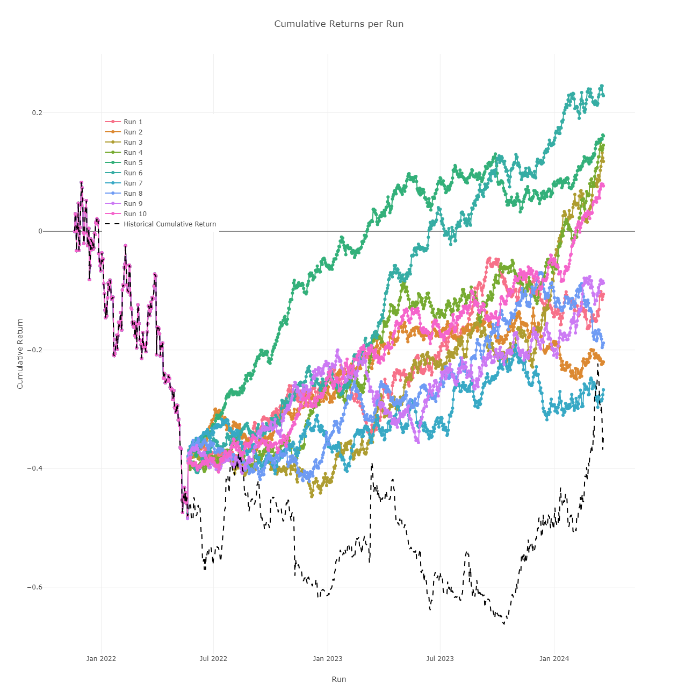
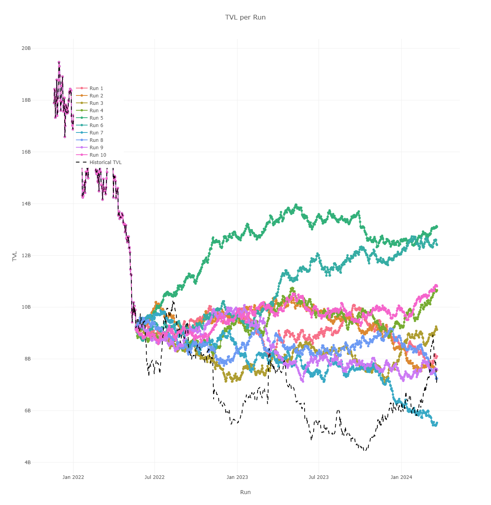
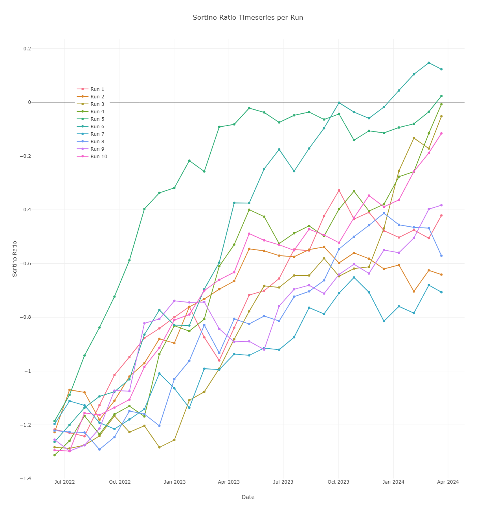
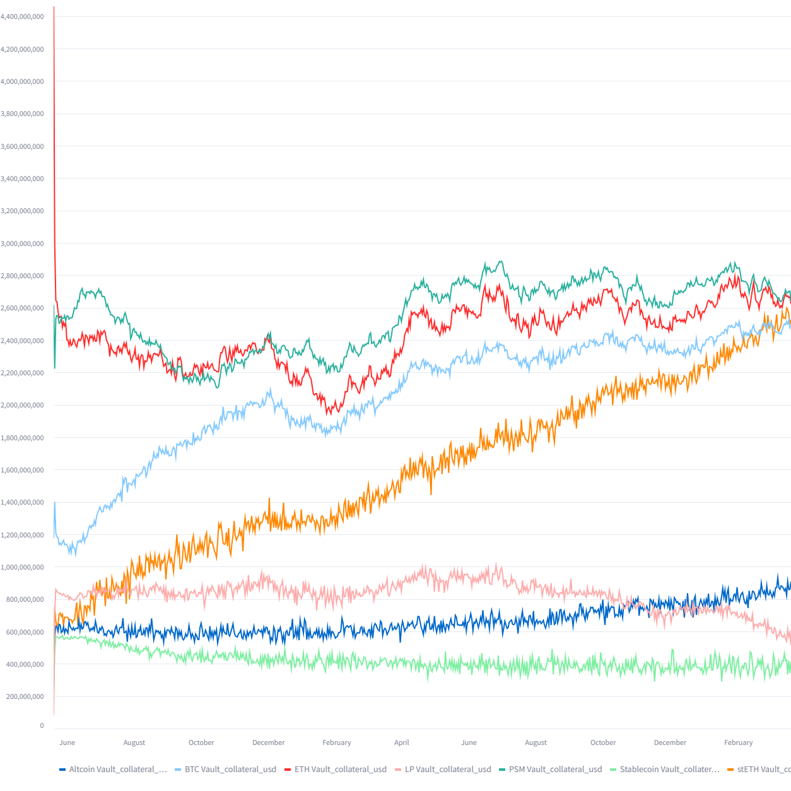

# Vault Robo Advisor Results

## Average Run

### Configuration

bounds = { 'BTC Vault\_collateral\_usd': (0.1, 0.3), 'ETH Vault\_collateral\_usd': (0.1, 0.5), 'stETH Vault\_collateral\_usd': (0.2, 0.3), 'Stablecoin Vault\_collateral\_usd': (0.0, 0.05), 'Altcoin Vault\_collateral\_usd': (0.0, 0.05), 'LP Vault\_collateral\_usd': (0.05, 0.05), 'RWA Vault\_collateral\_usd': (0.05, 0.05), 'PSM Vault\_collateral\_usd': (0.05, 0.2) }

initial strategy = { "BTC Vault\_collateral\_usd": 0.1, "ETH Vault\_collateral\_usd": 0.1999999999999995, "stETH Vault\_collateral\_usd": 0.3, "Stablecoin Vault\_collateral\_usd": 0.049999999999999496, "Altcoin Vault\_collateral\_usd": 0.049999999999999045, "LP Vault\_collateral\_usd": 0.05, "RWA Vault\_collateral\_usd": 0.05, "PSM Vault\_collateral\_usd": 0.2 }

vault\_action\_ranges = { 'stETH Vault\_dai\_ceiling': \[-0.5, 0.5], 'ETH Vault\_dai\_ceiling': \[-1, 0.5], 'BTC Vault\_dai\_ceiling': \[-1, 0.5], 'Altcoin Vault\_dai\_ceiling': \[-0.15,0.15], 'Stablecoin Vault\_dai\_ceiling': \[-0.1, 0.1], 'LP Vault\_dai\_ceiling': \[-0.1,0.1], 'RWA Vault\_dai\_ceiling': \[0, 0], 'PSM Vault\_dai\_ceiling': \[-1, 0.5] }

start\_date = '2022-05-20'&#x20;

end\_date = '2024-03-20'

num\_runs = 10&#x20;

seeds = \[5, 10, 15, 20, 40, 100, 200, 300, 500, 800]

initial\_strategy\_period=1

### RL Average Scores

* Cumulative Return: -19%
* Total Value Locked (TVL): 10,629,002,211
* Sortino Ratio: -0.22.

### MVO Scores

* Cumulative Return: -2.2%
* TVL: $7,195,864,283
* Sortino Ratio: -0.19

### Historical Scores

* Cumulative Return: -34%
* TVL: 7,342,533,784
* Sortino Ratio: -0.55

<figure><figcaption></figcaption></figure>

<figure><figcaption></figcaption></figure>

<figure><figcaption></figcaption></figure>

## Now lets look at one run in particular

### Configuration

bounds = { 'BTC Vault\_collateral\_usd': (0.1, 0.3), 'ETH Vault\_collateral\_usd': (0.1, 0.5), 'stETH Vault\_collateral\_usd': (0.2, 0.3), 'Stablecoin Vault\_collateral\_usd': (0.0, 0.05), 'Altcoin Vault\_collateral\_usd': (0.0, 0.05), 'LP Vault\_collateral\_usd': (0.05, 0.05), 'RWA Vault\_collateral\_usd': (0.05, 0.05), 'PSM Vault\_collateral\_usd': (0.05, 0.2) }

initial strategy = { "BTC Vault\_collateral\_usd": 0.1, "ETH Vault\_collateral\_usd": 0.1999999999999995, "stETH Vault\_collateral\_usd": 0.3, "Stablecoin Vault\_collateral\_usd": 0.049999999999999496, "Altcoin Vault\_collateral\_usd": 0.049999999999999045, "LP Vault\_collateral\_usd": 0.05, "RWA Vault\_collateral\_usd": 0.05, "PSM Vault\_collateral\_usd": 0.2 }

vault\_action\_ranges = { 'stETH Vault\_dai\_ceiling': \[-0.5, 0.5], 'ETH Vault\_dai\_ceiling': \[-1, 0.5], 'BTC Vault\_dai\_ceiling': \[-1, 0.5], 'Altcoin Vault\_dai\_ceiling': \[-0.15,0.15], 'Stablecoin Vault\_dai\_ceiling': \[-0.1, 0.1], 'LP Vault\_dai\_ceiling': \[-0.1,0.1], 'RWA Vault\_dai\_ceiling': \[0, 0], 'PSM Vault\_dai\_ceiling': \[-1, 0.5] }

start\_date = '2022-05-20'&#x20;

end\_date = '2024-03-20'

Seed = 100

Initial Strategy Period = 1

### RL Scores

* Cumualtive Return: 22.57%
* TVL: $12,406,271,373
* Sortino Ratio:  0.16

historical portfolio value as of 2024-03-20:&#x20;

### MVO Scores

* Cumulative Return: 14.91%
* TVL: $7,624,769,419.51
* Sortino Ratio: 0.04

### Historical Scores

* Cumulative Return: -34.42%
* TVL: $7,342,533,784.81
* Sortino Ratio: -0.55

#### RL Results

<figure><figcaption></figcaption></figure>

<figure><figcaption></figcaption></figure>

<figure><figcaption></figcaption></figure>

<figure><figcaption></figcaption></figure>

<figure><figcaption></figcaption></figure>

<figure><figcaption></figcaption></figure>

<figure><figcaption></figcaption></figure>

<figure><figcaption></figcaption></figure>

#### MVO Model Results

<figure><figcaption></figcaption></figure>

#### Historical Comparison

<figure><figcaption></figcaption></figure>

### Comparisons

<figure><figcaption></figcaption></figure>

<figure><figcaption></figcaption></figure>

<figure><figcaption></figcaption></figure>

<figure><figcaption></figcaption></figure>

<figure><figcaption></figcaption></figure>

#### Robo Advisor Actions:




